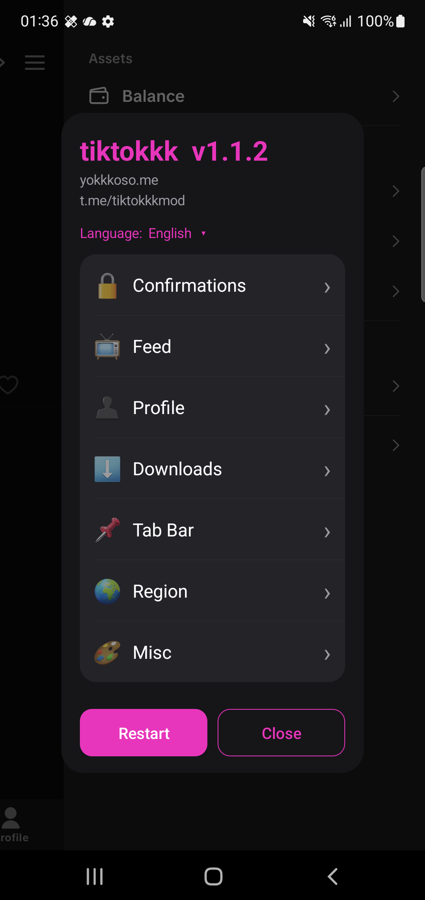

# tiktokkk

Xposed/LSPosed module for the Android TikTok app, with added tweaks and fixes.

<p align="center">
  
</p>

> ❗❗❗ **Only TikTok `46.0.3` is supported.** ❗❗❗
> Detection relies on TikTok's hardcoded (obfuscated) resource-ids and model symbols, which change
> on every TikTok update - on any other version features will silently misbehave or do nothing. The
> module logs the detected host version on start and warns if it isn't `46.0.3`.

This project bundles a set of quality-of-life tweaks for TikTok - ad and clutter filtering, action
confirmations, unrestricted and high-quality downloads, region spoofing, profile helpers, and more -
all configurable from an in-app settings panel, opened from **⚙️ tiktokkk - Mod settings** under
TikTok's own *Settings and privacy* menu.

When building from source, the module is compiled against the Android SDK and injected into TikTok
as either a rooted **LSPosed** module or a rootless **LSPatch** patch - see [Install](#install).

Added settings:
- **Feed ad filtering**: Hide sponsored posts across the For You, Following, and search feeds.
- **Clutter filtering**: Hide live streams, Shop posts, slideshows, stories, AI-generated posts, and
  rewarded/location/commission ads. Skip friend-recommendation cards.
- **Hide UI elements**: Fast-search bar, visual-search tag, Tako AI button, create (+) tab, tab
  labels, and notification badges — each independently toggleable.
- **Action confirmations**: Ask before like/unlike, follow, comment like/dislike, story like, quick
  share, or quick repost, so a mis-tap never fires.
- **Original (HQ) download**: The ⤓ button's top option saves the true no-watermark source
  (~20-30 MB) that TikTok never exposes in-app. Resolved via [tikwm.com](#third-party-service).
- **Download tweaks**: In-app quality picker, no-watermark native saves, bypass of download
  restrictions, and comment-sticker/GIF saving.
- **Feed extras**: Show a post's upload date and region flag (For You feed only); keep the seek bar
  always visible.
- **Profile**: Long-press to save the full-resolution avatar, long-press to copy bio text, and
  anonymous profile viewing.
- **Region spoof**: Spoof the carrier/SIM region without a VPN.
- **No surprise refreshes**: Stop the feed from refreshing on scroll-to-top or on Home-tap.

## Build

Requires **JDK 17** and the **Android SDK** (compile SDK 34). Builds unsigned — sign with your own key.

```bash
./gradlew :app:assembleRelease
apksigner sign --ks your-key.jks app/build/outputs/apk/release/app-release-unsigned.apk
```

## Install

Prebuilt APKs are posted in the [Telegram channel](https://t.me/tiktokkkmod), or install from the
F-Droid repos below for automatic updates.

**F-Droid (auto-updates):** add a repo in F-Droid / Droid-ify (Settings → Repositories → +):
- No root (rootless build): `https://fdroid.yokkkoso.me/rootless/repo`
- Root / LSPosed (module):  `https://fdroid.yokkkoso.me/root/repo`

Then find "tiktokkk" and install.

**Rooted (LSPosed):** install the signed APK, enable it in LSPosed, scope it to TikTok, then
force-stop/restart TikTok.

**Rootless (LSPatch):** patch the TikTok APK with LSPatch, embedding this module (integrated/local
mode, scope `com.zhiliaoapp.musically`), then install the patched TikTok. LSPatch re-signs the APK,
so it can't be stacked on another mod that relies on the original signature.

## Third-party service

The **Original (HQ)** download resolves the no-watermark source through the public service
**tikwm.com**, because TikTok caps every in-app stream (~5 MB) far below the original. Using this one
option sends the video's share URL (author handle + video id) to tikwm.com. Every other feature runs
entirely on-device, and all other download options use only TikTok's own URLs.

> **Unofficial and unaffiliated** — not associated with or endorsed by TikTok/ByteDance. Modifying
> the app may violate its Terms of Service. Use at your own risk.

## License

[CC BY-NC 4.0](LICENSE) — share and adapt for non-commercial use with attribution to yokkkoso.

## Join the Telegram channel for more info

[https://t.me/tiktokkkmod](https://t.me/tiktokkkmod)
